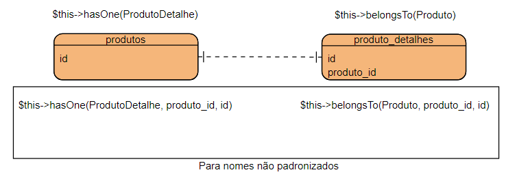

# Fianlizando o projeto
## 1 - Implementando o cadastro de fornecedores

Criar a pasta :file_folder: /views/app/fornecedor e o colocar :page_facing_up:fornecedor.blade.php dentro dela e renomear este arquivo para :page_facing_up:index.blade.php.

:page_facing_up:FornecedorController.php
```php
class FornecedorController extends Controller
{
    public function index()
    {
        return view('app.fornecedor.index');
    }

    public function listar(Request $request)
    {
        $fornecedores = Fornecedor::where('nome','like',"%".$request->input('nome')."%")
            ->where('email','like',"%".$request->input('email')."%")
            ->where('uf','like',"%".$request->input('uf')."%")
            ->where('site','like',"%".$request->input('site')."%")
            ->get();

        return view('app.fornecedor.listar',compact('fornecedores'));
    }

    public function adicionar(Request $request)
    {
        $msg = "";

        if ($request->input('_token') != '' && $request->input('id') == '') {
            
            //validacao
            $regras = [
                'nome' => 'required|min:3|max:40',
                'site' => 'required',
                'uf' => 'required|min:2|max:2',
                'email' => 'email'
            ];

            $feedback = [
                'required' => "O campo :attribute deve ser preenchido",
                'nome.min' => "O campo :attribute deve ter no minimo 3 caracteres",
                'nome.max' => "O campo :attribute deve ter no minimo 40 caracteres",
                'uf.min' => "O campo :attribute deve ter no minimo 2 caracteres",
                'uf.max' => "O campo :attribute deve ter no maximo 2 caracteres",
                'email' => "O campo :attribute não foi preenchido corretamente",
            ];

            $request->validate($regras,$feedback);
            
            Fornecedor::create($request->all());

            $msg = "Cadastro Feito com sucesso";

        }elseif ($request->input('_token') != '' && $request->input('id') != '') {
            $id = $request->input('id');
            $update = Fornecedor::find($id)->update($request->all());
            if ($update) {
                $msg = 'Update realizado com sucesso';
            }else{
                $msg = 'Update Falhou';
            }

            return redirect()->route('app.fornecedor.editar',compact('msg','id'));
        }

        return view('app.fornecedor.adicionar',compact('msg'));

    }

    public function editar($id,$msg = '')
    {
        $fornecedor = Fornecedor::find($id);

        return view('app.fornecedor.adicionar', compact('fornecedor','msg'));
    }

    public function excluir($id)
    {
        Fornecedor::find($id)->delete();
        
        return redirect()->route('app.fornecedor');
    }
}
```

:page_facing_up:web.php
```php
    Route::get('/fornecedor','FornecedorController@index')->name('app.fornecedor'); 
    Route::post('/fornecedor/listar','FornecedorController@listar')->name('app.fornecedor.listar'); 
    Route::get('/fornecedor/adicionar','FornecedorController@adicionar')->name('app.fornecedor.adicionar'); 
    Route::post('/fornecedor/adicionar','FornecedorController@adicionar')->name('app.fornecedor.adicionar'); 
    Route::get('/fornecedor/editar/{id}/{msg?}','FornecedorController@editar')->name('app.fornecedor.editar'); 
    Route::get('/fornecedor/excluir/{id}','FornecedorController@excluir')->name('app.fornecedor.excluir'); 

```

:page_facing_up:index.blade.php
```html
@section('conteudo')
    <div class="conteudo-pagina">
        <div class="titulo-pagina-2">
            <p>Fornecedor</p>
        </div>
        <div class="menu">
            <ul>
                <li><a href="{{ route('app.fornecedor.adicionar') }}">Novo</a></li>
                <li><a href="{{ route('app.fornecedor') }}">Consulta</a></li>

            </ul>
        </div>
        <div class="informacao-pagina">
            <div style="width: 30%; margin: 0 auto">
                <form action="{{ route('app.fornecedor.listar') }}" method="POST">
                    @csrf
                    <input type="text" name="nome" placeholder="nome" class="borda-preta">
                    <input type="text" name="site" placeholder="site" class="borda-preta">
                    <input type="text" name="uf" placeholder="UF" class="borda-preta">
                    <input type="text" name="email" placeholder="email" class="borda-preta">
                    <button type="submit" class="borda-preta">Pesquisa</button>
                </form>
            </div>
        </div>
    </div>
@endsection
```

:page_facing_up:adicionar.blade.php

Esta página terá o mesmo conteudo da página acima com algumas alterações
```html
@section('conteudo')
    <div class="conteudo-pagina">
        <div class="titulo-pagina-2">
            <p>Fornecedor - Adicionar</p>
        </div>
        <div class="menu">
            <ul>
                <li><a href="{{ route('app.fornecedor.adicionar') }}">Novo</a></li>
                <li><a href="{{ route('app.fornecedor') }}">Consulta</a></li>

            </ul>
        </div>
        <div class="informacao-pagina">
            <div style="width: 30%; margin: 0 auto">
                <form action="{{ route('app.fornecedor.adicionar') }}" method="POST">
                    @csrf
                    <input type="hidden" name="id" value={{ $fornecedor->id ?? ''}}>
                    {{ $msg ?? ''}}
                    <input type="text" name="nome" placeholder="nome" class="borda-preta" value="{{$fornecedor->nome ?? old('nome')}}">
                    {{ ($errors->has('nome')) ? $errors->first('nome') : '' }}

                    <input type="text" name="site" placeholder="site" class="borda-preta" value="{{$fornecedor->site ?? old('site')}}">
                    {{ ($errors->has('site')) ? $errors->first('site') : '' }}

                    <input type="text" name="uf" placeholder="UF" class="borda-preta" value="{{$fornecedor->uf ?? old('uf')}}">
                    {{ ($errors->has('uf')) ? $errors->first('uf') : '' }}

                    <input type="text" name="email" placeholder="email" class="borda-preta" value="{{$fornecedor->email ?? old('email')}}">
                    {{ ($errors->has('email')) ? $errors->first('email') : '' }}

                    <button type="submit" class="borda-preta">Adicionar</button>
                </form>
            </div>
        </div>
    </div>
@endsection
```

:page_facing_up:listar.blade.php
```html
@section('conteudo')
    <div class="conteudo-pagina">
        <div class="titulo-pagina-2">
            <p>Fornecedor - Listar</p>
        </div>
        <div class="menu">
            <ul>
                <li><a href="{{ route('app.fornecedor.adicionar') }}">Novo</a></li>
                <li><a href="{{ route('app.fornecedor') }}">Consulta</a></li>

            </ul>
        </div>
        <div class="informacao-pagina">
            <div style="width: 90%; margin: 0 auto;">
                <table border="1" width="100%">
                    <thead>
                        <tr>
                            <th>Nome</th>
                            <th>Site</th>
                            <th>UF</th>
                            <th>Email</th>
                            <th></th>
                            <th></th>
                        </tr>
                    </thead>
                    <tbody>
                        @foreach ($fornecedores as $fornecedor)
                            <tr>
                                <td>{{$fornecedor->nome}}</td>
                                <td>{{$fornecedor->site}}</td>
                                <td>{{$fornecedor->uf}}</td>
                                <td>{{$fornecedor->email}}</td>
                                <td><a href={{route('app.fornecedor.excluir',$fornecedor->id)}}>Excluir</a></td>
                                <td><a href={{route('app.fornecedor.editar',$fornecedor->id)}}>Editar</a></td>
                            </tr>
                        @endforeach        
                    </tbody>
                </table>
            </div>
        </div>
    </div>
@endsection
```

## 2 - Paginação de registros

:page_facing_up:FornecedorController.php
```php
public function listar(Request $request)
{
    $fornecedores = Fornecedor::where('nome','like',"%".$request->input('nome')."%")
        ->where('email','like',"%".$request->input('email')."%")
        ->where('uf','like',"%".$request->input('uf')."%")
        ->where('site','like',"%".$request->input('site')."%")
        ->paginate(2);

    $request = $request->all();


    return view('app.fornecedor.listar',compact('fornecedores','request'));
}
```

Replicar a rota 'app.fornecedor.listar' e alterar metodo post para o método get
:page_facing_up:web.php
```php
    Route::get('/fornecedor/listar','FornecedorController@listar')->name('app.fornecedor.listar'); 
```

Adicionar após a tag `<table>`

:page_facing_up:listar.blade.php
```html
{{ $fornecedores->appends($request)->links() }}
```

Outros métodos do paginate() para serem usados no blade

`$fornecedores->count()` - Total de registros mostrados em cada página

`$fornecedores->total()` - Total de registros da consulta

`$fornecedores->first()` - nº primeiro registro da página

`$fornecedores->last()`  - nºúltimo registro da página

:page_facing_up:estilo_basico.css
```css
.pagination li{
    display: inline;
    margin: 0 5px;
}
```

## 3 - Controladores com resources

Com a instrução `php artisan make:controller -r [nome_do_controlador]` é possivel criar um controlador responsável por fazer o crud básico de um modelo

`index()` - exibe a lista de registros

`create()` - exibe formulário de criação do registro

`store()` - recebe formulário de criação do registro

`show()` - exibe um registro específico

`edit()` - exibe formulário de edição do registro

`update()` - recebe o formulário de edição do registro

`destroy()` - recebe os dados para remoção do registro

E então, em `web.php` só é necessário adicionar uma linha
```php
    Route::resource('produto', 'ProdutoController');    
```

## 4 - Implementando o cadastro de produtos

:page_facing_up:ProdutoController.php
```php
class ProdutoController extends Controller
{
    /**
     * Display a listing of the resource.
     *
     * @return \Illuminate\Http\Response
     */
    public function index(Request $request)
    {
        $produtos = Produto::paginate(3);

        $request = $request->all();

        return view('app.produto.index',compact('produtos','request'));
    }

    /**
     * Show the form for creating a new resource.
     *
     * @return \Illuminate\Http\Response
     */
    public function create()
    {
        $unidades = Unidade::all();
        return view('app.produto.create',compact('unidades'));
    }

    /**
     * Store a newly created resource in storage.
     *
     * @param  \Illuminate\Http\Request  $request
     * @return \Illuminate\Http\Response
     */
    public function store(Request $request)
    {
        $regras = [
            'nome' => 'required|min:3|max:40',
            'descricao' => 'required|min:3|max:2000',
            'peso' => 'required|integer',
            'unidade_id' => 'exists:unidades,id',
        ];
        $request->validate($regras);

        Produto::create($request->all());
        return redirect()->route('produto.index');
    }

    /**
     * Display the specified resource.
     *
     * @param  int  $id
     * @return \Illuminate\Http\Response
     */
    public function show($id)
    {
        $produto = Produto::find($id);

        return view('app.produto.show',compact('produto'));
    }

    /**
     * Show the form for editing the specified resource.
     *
     * @param  int  $id
     * @return \Illuminate\Http\Response
     */
    public function edit($id)
    {
        $produto = Produto::find($id);
        $unidades = Unidade::all();

        return view('app.produto.edit',compact('produto','unidades'));

    }

    /**
     * Update the specified resource in storage.
     *
     * @param  \Illuminate\Http\Request  $request
     * @param  int  $id
     * @return \Illuminate\Http\Response
     */
    public function update(Request $request, $id)
    {
        $produto = Produto::find($id)->update($request->all());
        return redirect()->route('produto.show',['produto'=>$id]);
    }

    /**
     * Remove the specified resource from storage.
     *
     * @param  int  $id
     * @return \Illuminate\Http\Response
     */
    public function destroy($id)
    {
        $produto = Produto::destroy($id);
        return redirect()->route('produto.index');
    }
}
```


:page_facing_up:index.blade.php
```html
@section('conteudo')
    <div class="conteudo-pagina">
        <div class="titulo-pagina-2">
            <p>Listagem de Produtos</p>
        </div>
        <div class="menu">
            <ul>
                <li><a href="{{ route('produto.create') }}">Novo</a></li>
                <li><a href="{{ route('produto.index') }}">Consulta</a></li>

            </ul>
        </div>
        <div class="informacao-pagina">
            <div style="width: 90%; margin: 0 auto;">
                <table border="1" width="100%">
                    <thead>
                        <tr>
                            <th>Nome</th>
                            <th>Descrição</th>
                            <th>Peso</th>
                            <th>Unidade ID</th>
                            <th></th>
                            <th></th>
                            <th></th>
                        </tr>
                    </thead>
                    <tbody>
                        @foreach ($produtos as $produto)
                            <tr>
                                <td>{{$produto->nome}}</td>
                                <td>{{$produto->descricao}}</td>
                                <td>{{$produto->peso}}</td>
                                <td>{{$produto->unidade_id}}</td>
                                <td><a href={{route('produto.show',$produto->id)}}>Vizualizar</a></td>
                                <td>
                                    <form id="form_{{$produto->id}}" action="{{route('produto.destroy',$produto->id)}}" method="post">
                                    @method('DELETE')
                                    @csrf
                                    </form>
                                    <a href="#" onclick="document.getElementById('form_{{$produto->id}}').submit()">Excluir</a>
                                </td>
                                <td><a href={{route('produto.edit',$produto->id)}}>Editar</a></td>
                            </tr>
                        @endforeach        
                    </tbody>
                </table>
                {{ $produtos->appends($request)->links() }}
            </div>
        </div>
    </div>
@endsection
```

:page_facing_up:create.blade.php
```html
@section('conteudo')
    <div class="conteudo-pagina">
        <div class="titulo-pagina-2">
            <p>Adicionar Produto</p>
        </div>
        <div class="menu">
            <ul>
                <li><a href="{{ route('produto.index') }}">Voltar</a></li>
                <li><a href="{{ route('produto.index') }}">Consulta</a></li>

            </ul>
        </div>
        <div class="informacao-pagina">
            <div style="width: 30%; margin: 0 auto">
                <form action="{{ route('produto.store') }}" method="POST">
                    @csrf
                    {{ $msg ?? ''}}
                    <input type="text" name="nome" placeholder="nome" class="borda-preta" value="{{old('nome')}}">
                    {{$errors->has('nome') ? $errors->first('nome') : ''}}
                    <input type="text" name="descricao" placeholder="descricao" class="borda-preta" value="{{old('descricao')}}">
                    {{$errors->has('descricao') ? $errors->first('descricao') : ''}}
                    <input type="text" name="peso" placeholder="peso" class="borda-preta" value="{{old('peso')}}">
                    {{$errors->has('peso') ? $errors->first('peso') : ''}}
                    <select name="unidade_id">
                        <option selected>--Selecione a unidade de medida--</option>
                        @foreach ($unidades as $unidade)
                            <option value={{$unidade->id}} {{old('unidade_id') == $unidade->id ? 'selected' : ''}}>{{$unidade->descricao}}</option>
                        @endforeach
                    </select>
                    {{$errors->has('unidade_id') ? $errors->first('unidade_id') : ''}}
                    <button type="submit" class="borda-preta">Adicionar</button>
                </form>
            </div>
        </div>
    </div>
@endsection
```

:page_facing_up:show.blade.php
```html
@section('conteudo')
    <div class="conteudo-pagina">
        <div class="titulo-pagina-2">
            <p>Vizualizar Produto</p>
        </div>
        <div class="menu">
            <ul>
                <li><a href="{{ route('produto.index') }}">Voltar</a></li>
                <li><a href="{{ route('produto.index') }}">Consulta</a></li>

            </ul>
        </div>
        <div class="informacao-pagina">
            <div style="width: 30%; margin: 0 auto">
                <table border="1">
                    <tr>
                        <td>ID:</td>
                        <td>{{$produto->id}}</td>
                    </tr>
                    <tr>
                        <td>Nome:</td>
                        <td>{{$produto->nome}}</td>
                    </tr>
                    <tr>
                        <td>Descricao:</td>
                        <td>{{$produto->descricao}}</td>
                    </tr>
                    <tr>
                        <td>Peso:</td>
                        <td>{{$produto->peso}} kg</td>
                    </tr>
                    <tr>
                        <td>Unidade de medida:</td>
                        <td>{{$produto->unidade_id}}</td>
                    </tr>
                </table>
            </div>
        </div>
    </div>
@endsection
```

:page_facing_up:edit.blade.php
```html
@section('conteudo')
    <div class="conteudo-pagina">
        <div class="titulo-pagina-2">
            <p>Editar Produto</p>
        </div>
        <div class="menu">
            <ul>
                <li><a href="{{ route('produto.index') }}">Voltar</a></li>
                <li><a href="{{ route('produto.index') }}">Consulta</a></li>

            </ul>
        </div>
        <div class="informacao-pagina">
            <div style="width: 30%; margin: 0 auto">
                <form action="{{ route('produto.update',$produto->id) }}" method="POST">
                    @method('PUT')
                    @csrf
                    {{ $msg ?? ''}}
                    <input type="text" name="nome" placeholder="nome" class="borda-preta" value="{{$produto->nome ?? old('nome')}}">
                    {{$errors->has('nome') ? $errors->first('nome') : ''}}
                    <input type="text" name="descricao" placeholder="descricao" class="borda-preta" value="{{$produto->descricao ?? old('descricao')}}">
                    {{$errors->has('descricao') ? $errors->first('descricao') : ''}}
                    <input type="text" name="peso" placeholder="peso" class="borda-preta" value="{{$produto->peso ?? old('peso')}}">
                    {{$errors->has('peso') ? $errors->first('peso') : ''}}
                    <select name="unidade_id">
                        <option selected>--Selecione a unidade de medida--</option>
                        @foreach ($unidades as $unidade)
                            <option value={{$unidade->id}} {{($produto->unidade_id ?? old('unidade_id')) == $unidade->id ? 'selected' : ''}}>{{$unidade->descricao}}</option>
                        @endforeach
                    </select>
                    {{$errors->has('unidade_id') ? $errors->first('unidade_id') : ''}}
                    <button type="submit" class="borda-preta">Adicionar</button>
                </form>
            </div>
        </div>
    </div>
@endsection
```

Outras duas formas de fazer a edição dos registros:

### 4.1 - Modificando a forma de edição de registros

Apagar o arquivo :page_facing_up:create.blade.php e

Renomear o arquivo :page_facing_up:edit.blade.php para :page_facing_up:create.blade.php

Alterar `app.produto.edit` para `app.produto.create` no arquivo :page_facing_up:create.blade.php
```php
public function edit($id)
{
    $produto = Produto::find($id);
    $unidades = Unidade::all();

    return view('app.produto.create',compact('produto','unidades'));

}
```

:page_facing_up:create.blade.php
```html
@section('conteudo')
    <div class="conteudo-pagina">
        <div class="titulo-pagina-2">
            @if (isset($produto->id))
                <p>Editar Produto</p>
            @else
                <p>Adicionar Produto</p>
            @endif
        </div>
        <div class="menu">
            <ul>
                <li><a href="{{ route('produto.index') }}">Voltar</a></li>
                <li><a href="{{ route('produto.index') }}">Consulta</a></li>

            </ul>
        </div>
        <div class="informacao-pagina">
            <div style="width: 30%; margin: 0 auto">
                @if (isset($produto->id))
                <form action="{{ route('produto.update',$produto->id) }}" method="POST">
                    @method('PUT')
                @else
                <form action="{{ route('produto.store') }}" method="POST">
                    @method('POST')
                @endif
                    @csrf
                    {{ $msg ?? ''}}
                    <input type="text" name="nome" placeholder="nome" class="borda-preta" value="{{$produto->nome ?? old('nome')}}">
                    {{$errors->has('nome') ? $errors->first('nome') : ''}}
                    <input type="text" name="descricao" placeholder="descricao" class="borda-preta" value="{{$produto->descricao ?? old('descricao')}}">
                    {{$errors->has('descricao') ? $errors->first('descricao') : ''}}
                    <input type="text" name="peso" placeholder="peso" class="borda-preta" value="{{$produto->peso ?? old('peso')}}">
                    {{$errors->has('peso') ? $errors->first('peso') : ''}}
                    <select name="unidade_id">
                        <option selected>--Selecione a unidade de medida--</option>
                        @foreach ($unidades as $unidade)
                            <option value={{$unidade->id}} {{($produto->unidade_id ?? old('unidade_id')) == $unidade->id ? 'selected' : ''}}>{{$unidade->descricao}}</option>
                        @endforeach
                    </select>
                    {{$errors->has('unidade_id') ? $errors->first('unidade_id') : ''}}
                    <button type="submit" class="borda-preta">
                        @if (isset($produto->id))
                            Alterar
                        @else
                            Cadastrar
                        @endif
                    </button>
                </form>
            </div>
        </div>
    </div>
@endsection
```

### 4.2 - Modificando a forma de edição de registros

Criar um componente dentro da pasta produto :open_folder:_component :page_facing_up:form_create_edit.blade.php

```html
@if (isset($produto->id))
<form action="{{ route('produto.update',$produto->id) }}" method="POST">
    @method('PUT')
@else
<form action="{{ route('produto.store') }}" method="POST">
    @method('POST')
@endif
    @csrf
    {{ $msg ?? ''}}
    <input type="text" name="nome" placeholder="nome" class="borda-preta" value="{{$produto->nome ?? old('nome')}}">
    {{$errors->has('nome') ? $errors->first('nome') : ''}}
    <input type="text" name="descricao" placeholder="descricao" class="borda-preta" value="{{$produto->descricao ?? old('descricao')}}">
    {{$errors->has('descricao') ? $errors->first('descricao') : ''}}
    <input type="text" name="peso" placeholder="peso" class="borda-preta" value="{{$produto->peso ?? old('peso')}}">
    {{$errors->has('peso') ? $errors->first('peso') : ''}}
    <select name="unidade_id">
        <option selected>--Selecione a unidade de medida--</option>
        @foreach ($unidades as $unidade)
            <option value={{$unidade->id}} {{($produto->unidade_id ?? old('unidade_id')) == $unidade->id ? 'selected' : ''}}>{{$unidade->descricao}}</option>
        @endforeach
    </select>
    {{$errors->has('unidade_id') ? $errors->first('unidade_id') : ''}}
    <button type="submit" class="borda-preta">
        @if (isset($produto->id))
            Alterar
        @else
            Cadastrar
        @endif
    </button>
</form>
```

:page_facing_up:create.blade.php
```html
@section('conteudo')
    <div class="conteudo-pagina">
        <div class="titulo-pagina-2">
            <p>Adicionar Produto</p>
        </div>
        <div class="menu">
            <ul>
                <li><a href="{{ route('produto.index') }}">Voltar</a></li>
                <li><a href="{{ route('produto.index') }}">Consulta</a></li>

            </ul>
        </div>
        <div class="informacao-pagina">
            <div style="width: 30%; margin: 0 auto">
                @component('app.produto._components.form_create_edit',compact('unidades'))
                    
                @endcomponent
            </div>
        </div>
    </div>
@endsection
```

:page_facing_up:edit.blade.php
```html
@section('conteudo')
    <div class="conteudo-pagina">
        <div class="titulo-pagina-2">
            <p>Editar Produto</p>
        </div>
        <div class="menu">
            <ul>
                <li><a href="{{ route('produto.index') }}">Voltar</a></li>
                <li><a href="{{ route('produto.index') }}">Consulta</a></li>

            </ul>
        </div>
        <div class="informacao-pagina">
            <div style="width: 30%; margin: 0 auto">
                @component('app.produto._components.form_create_edit',compact('produto','unidades'))
                    
                @endcomponent
            </div>
        </div>
    </div>
@endsection
```

## 5 - Relacionamentos
`php artisan make:model ProdutoDetalhe`

`php artisan make:controller ProdutoDetalheController -r`

:page_facing_up:web.php
```php
Route::resource("produto-detalhe","ProdutoDetalheController");
```

Fazer a mesma coisa que o item 4.2 só que com a tabela produto_detalhes

### 1 para 1
Abrir o Modelo Produto.php e inserir um método que retorne o modelo referenciado que possui o id
da referencia em sua tabela

:page_facing_up:Produto.php
```php
class Produto extends Model
{
    protected $fillable = ['nome','descricao','peso','unidade_id'];

    public function pdodutoDetalhe()
    {
        return $this->hasOne('App\ProdutoDetalhe');

        //produto tem 1 produtoDetalhe
        
        //ele deve procurar um registro relacionado em produto_detalhes
    }
}
```

:page_facing_up:index.blade.php
```html
<td>{{$produto->nome}}</td>
<td>{{$produto->descricao}}</td>
<td>{{$produto->peso}}</td>
<td>{{$produto->unidade_id}}</td>
<td>{{$produto->produtoDetalhe->comprimento ?? ''}}</td>
<td>{{$produto->produtoDetalhe->altura ?? ''}}</td>
<td>{{$produto->produtoDetalhe->largura ?? ''}}</td>
```

Também é possível fazer o contrário. Atribuir um método que retorne o modelo de referencia que que possui o id referenciado em sua tabela

```php
class Produto extends Model
{
    protected $fillable = ['nome','descricao','peso','unidade_id'];

    public function produto()
    {
        return $this->belongsTo('App\Produto');
    }
}
```

:page_facing_up:edit.blade.php
```html
<div class="informacao-pagina">

    <h4>Produto</h4>
    <div>Nome: {{ $produto_detalhe->produto->nome }}</div>
    <br>
    <div>Descrição: {{ $produto_detalhe->produto->descricao }}</div>
    <br>

    <div style="width: 30%; margin: 0 auto">
        @component('app.produto_detalhe._components.form_create_edit',compact('produto_detalhe','unidades'))
            
        @endcomponent
    </div>
</div>
```


- Lazy Loading X Eager Loading

O método padrão é o lazy loading (carregamento lento). Para mudar para o eager loading (carregamento ansioso) é necessário acessar o controller e realizar a seguinte troca. Ex:

```php
public function edit($id)
{
    //de
    $produto = Produto::find($id);
    //para
    $produto = Produto::with(['ProdutoDetalhe'])->find($id);   
}
```

repare que dentro do array do método with voce poderá adicionar todos os relacionamentos necessários para o eager loading

### 1 para N

`php artisan make:migration alter_produtos_relacionamento_fornecedores`

```php
class AlterProdutosRelacionamentoFornecedores extends Migration
{
    /**
     * Run the migrations.
     *
     * @return void
     */
    public function up()
    {
        Schema::table('produtos',function (Blueprint $table)
        {
            $fornecedor_id = DB::table('fornecedores')->insertGetId([
                'nome' => 'Fornecedor padrão SG',
                'site' => 'fornecedorpadraosg.co.br',
                'uf' => 'SP',
                'email' => 'contato@fornecedorpadraosg.com.br'
            ]);

            $table->unsignedBigInteger('fornecedor_id')->default($fornecedor_id)->after('id');
            $table->foreign('fornecedor_id')->references('id')->on('fornecedores');
        });
    }

    /**
     * Reverse the migrations.
     *
     * @return void
     */
    public function down()
    {
        Schema::table('produtos',function (Blueprint $table)
        {

            $table->dropForeign('produtos_fornecedor_id_foreign');
            $table->dropColumn('fornecedor_id');
            
        });
    }
}
```

`php artisan migrate`

:page_facing_up:app/produto/index.blade.php

```html
<th>Fornecedor</th>
<td>$produto->fornecedor_id<td>
```

:page_facing_up:Produto.php
```php
public function fornecedor()
{
    return $this->belongsTo('App\Fornecedor');
}
```

:page_facing_up:Fornecedor.php
```php
public function produtos()
{
    return $this->hasMany('App\Fornecedor');
}
```


```html
<tbody>
    @foreach ($fornecedores as $fornecedor)
        <tr>
            <td>{{$fornecedor->nome}}</td>
            <td>{{$fornecedor->site}}</td>
            <td>{{$fornecedor->uf}}</td>
            <td>{{$fornecedor->email}}</td>
            <td><a href={{route('app.fornecedor.excluir',$fornecedor->id)}}>Excluir</a></td>
            <td><a href={{route('app.fornecedor.editar',$fornecedor->id)}}>Editar</a></td>
        </tr>
        <tr>
            <td colspan="6">
                <p>Lista de Produtos</p>
                <table border="1" style="margin:20px;">
                    <thead>
                        <tr>
                            <th>ID</th>
                            <th>Nome</th>
                        </tr>
                    </thead>
                    <tbody>
                        @foreach ($fornecedor->produtos as $produto)
                            <tr>
                                <td>{{$produto->id}}</td>
                                <td>{{$produto->nome}}</td>
                            </tr>
                        @endforeach 
                    </tbody>
                </table>
            </td>
            
        </tr>
    @endforeach        
</tbody>
```

### N para N

`php artisan make:model Cliente`

`php artisan make:model Pedido`

`php artisan make:model PedidoProduto`

`php artisan make:migration create_clientes_pedidos_produtos`

```php
class CreateClientesPedidosProdutos extends Migration
{
    /**
     * Run the migrations.
     *
     * @return void
     */
    public function up()
    {
        Schema::create('clientes', function (Blueprint $table) {
            $table->id();
            $table->string('nome',50);
            $table->timestamps();
        });

        Schema::create('pedidos', function (Blueprint $table) {
            $table->id();
            $table->unsignedBigInteger('cliente_id');
            $table->timestamps();

            $table->foreign('cliente_id')->references('id')->on('clientes');
        });

        Schema::create('pedidos_produtos', function (Blueprint $table) {
            $table->id();
            $table->unsignedBigInteger('pedido_id');
            $table->unsignedBigInteger('produto_id');
            $table->timestamps();

            $table->foreign('pedido_id')->references('id')->on('pedidos');
            $table->foreign('produto_id')->references('id')->on('produtos');
        });
    }

    /**
     * Reverse the migrations.
     *
     * @return void
     */
    public function down()
    {
        //desabilita a restrição de foreign key
        Schema::disableForeignKeyConstraints();

        Schema::dropIfExists('clientes');
        Schema::dropIfExists('pedidos');
        Schema::dropIfExists('pedidos_produtos');

        Schema::enableForeignKeyConstraints();

    }
}
```

`php artisan migration`

`php artisan make:controller ClienteController -r`

`php artisan make:controller PedidoController -r`

`php artisan make:controller PedidoProdutoController -r`

:page_facing_up:web.php
```php
Route::prefix('/app')->middleware('autenticacao:padrao,visitante,p3,p4')->group(function(){
    Route::resource('cliente', ClienteController::class);
    Route::resource('pedido', PedidoController::class);
});
```

Fazer o mesmo processo das telas anteriores para o Pedido e o Cliente

:page_facing_up:web.php
```php
Route::prefix('/app')->middleware('autenticacao:padrao,visitante,p3,p4')->group(function(){

    Route::get('pedido-produto/create/{pedido_id}','PedidoProdutoController@create')->name('pedido-produto.create');
    Route::post('pedido-produto/store/{pedido_id}','PedidoProdutoController@store')->name('pedido-produto.store');

});
```
adicionar a referencia a essa rota 

:page_facing_up:views/app/pedido/index.blade.php
```html
<td>{{$pedido->id}}</td>                                
<td>{{$pedido->cliente_id}}</td>                                
<td><a href={{route('pedido-produto.create',$pedido->id)}}>Adicionar Produtos</a></td>
<td><a href={{route('pedido.show',$pedido->id)}}>Vizualizar</a></td>
```

:page_facing_up:PedidoProdutoController.php
```php
class PedidoProdutoController extends Controller
{
    /**
     * Show the form for creating a new resource.
     *
     * @return \Illuminate\Http\Response
     */
    public function create($pedido_id)
    {
        $pedido = Pedido::find($pedido_id);

        $produtos = Produto::all();

        return view('app.pedido_produto.create',compact('pedido','produtos'));
    }

    /**
     * Store a newly created resource in storage.
     *
     * @param  \Illuminate\Http\Request  $request
     * @return \Illuminate\Http\Response
     */
    public function store(Request $request, $pedido_id)
    {
        $regras = [
            'produto_id' => 'exists:produtos,id'
        ];

        $request->validate($regras);

        $pedidoProduto = new PedidoProduto();
        $pedidoProduto->pedido_id = $pedido_id;
        $pedidoProduto->produto_id = $request->input('produto_id');
        $pedidoProduto->save();
        
        return redirect()->route('pedido-produto.create', compact('pedido_id'));

    }
}
```

:page_facing_up:views/app/pedido_produto/create.blade.php
```html
@extends('app.layouts.basico')

@section('titulo','Pedido Produto')
    
@section('conteudo')
    <div class="conteudo-pagina">
        <div class="titulo-pagina-2">
            <p>Adicionar Produtos ao pedido</p>
        </div>
        <div class="menu">
            <ul>
                <li><a href="{{ route('pedido.index') }}">Voltar</a></li>
                <li><a href="">Consulta</a></li>

            </ul>
        </div>
        <div class="informacao-pagina">
            <h4>Detalhes do pedido</h4>
            <p>ID do pedido: {{ $pedido->id }}</p>
            <p>ID do cliente: {{ $pedido->cliente_id }}</p>

            <div style="width: 30%; margin: 0 auto">
                @component('app.pedido_produto._components.form_create',compact('pedido','produtos'))
                    
                @endcomponent
            </div>
        </div>
    </div>
@endsection
```

:page_facing_up:views/app/pedido_produto/_components/form_create.blade.php
```html
<form action="{{ route('pedido-produto.store', ['pedido_id'=>$pedido]) }}" method="POST">
    @csrf   
    {{ $msg ?? ''}}
    
    <select name="produto_id">
        <option selected>--Selecione o Produto--</option>
        @foreach ($produtos as $produto)
            <option value={{ $produto->id }} {{ old('produto_id') == $produto->id ? 'selected' : ''}}>{{$produto->nome}}</option>
        @endforeach
    </select>
    {{$errors->has('produto_id') ? $errors->first('produto_id') : ''}}
    
    <button type="submit" class="borda-preta">
        @if (isset($pedido->id))
            Alterar
        @else
            Cadastrar
        @endif
    </button>
</form>
```


:page_facing_up:Pedido.php
```php
class Pedido extends Model
{
    //protected $fillable = ['cliente_id'];

    public function produtos()
    {
        //nomes padronizados
        return $this->belongsToMany('App\Produto','pedidos_produtos');

        //nomes não padronizados
        // return $this->belongsToMany('App\Produto','pedidos_produtos','pedido_id','produto_id');
    }
}
```

Para os **nomes não padronizados**:

- 3º parametro: representa o nome da FK da tabela mapeada pelo model na tabela de relacionamento;

- 4º parametro: representa o nome da FK da tabela mapeada pelo model utilizado no relacionamento que estamos implementando;

:page_facing_up:views/app/pedido_produto/create.blade.php
```html
@extends('app.layouts.basico')

@section('titulo','Pedido Produto')
    
@section('conteudo')
    <div class="conteudo-pagina">
        <div class="titulo-pagina-2">
            <p>Adicionar Produtos ao pedido</p>
        </div>
        <div class="menu">
            <ul>
                <li><a href="{{ route('pedido.index') }}">Voltar</a></li>
                <li><a href="">Consulta</a></li>

            </ul>
        </div>
        <div class="informacao-pagina">
            <h4>Detalhes do pedido</h4>
            <p>ID do pedido: {{ $pedido->id }}</p>
            <p>ID do cliente: {{ $pedido->cliente_id }}</p>

            <div style="width: 30%; margin: 0 auto">
                <h4>Itens do pedido</h4>
                <table border="1" width="100%">
                    <thead>
                        <tr>
                            <th>ID</th>
                            <th>Nome do produto</th>
                        </tr>
                    </thead>
                    <tbody>
                        @foreach ($pedido->produtos as $produto)
                            <tr>
                                <td>{{ $produto->id }}</td>
                                <td>{{ $produto->nome }}</td>
                            </tr>
                        @endforeach
                    </tbody>
                </table>
                @component('app.pedido_produto._components.form_create',compact('pedido','produtos'))
                    
                @endcomponent
            </div>
        </div>
    </div>
@endsection
```

Fazer o mesmo com a tela de produtos porém na ordem inversa

**Pivot** é usado para recuperar as colunas da tabela intermediária.

```php
return $this->belongsToMany('App\Produto','pedidos_produtos')->withPivot('created_at');
```

```html
<td>{{ $produto->pivot->created_at->format('d/m/Y') }}</td>
```

**Attach** permite adicionar valores a tabela intermediária de forma mais fácil.
```php
$pedido->produtos()->attach([
    $request->input('produto_id') => ['quantidade' => $request->input('quantidade')]
]);
```

**Attach** é usado para desanexar/excluir um relacionamento muitos p/ muitos.
```php
$pedido->produtos()->detach([$produto_id]);
```

